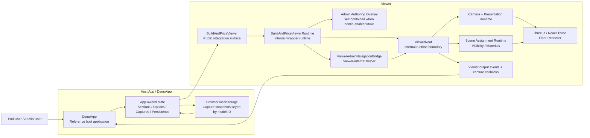
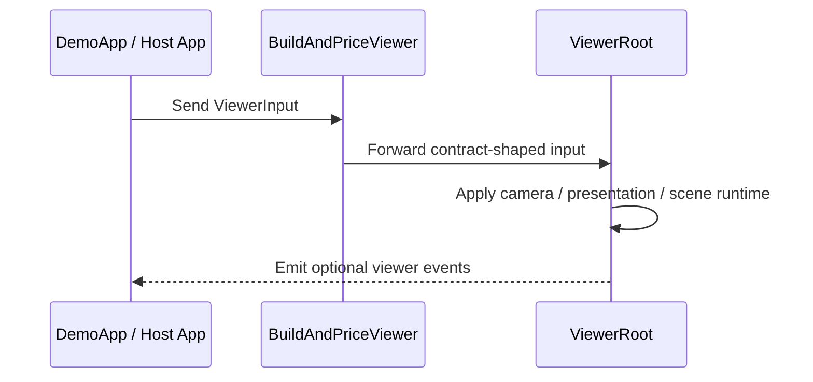
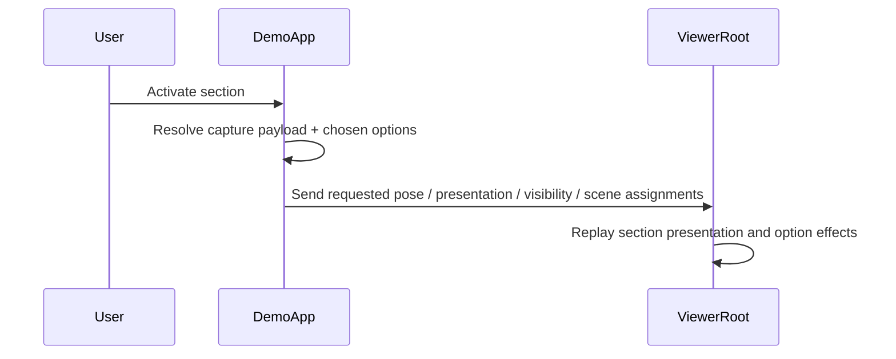
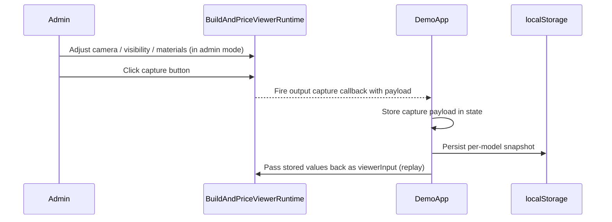
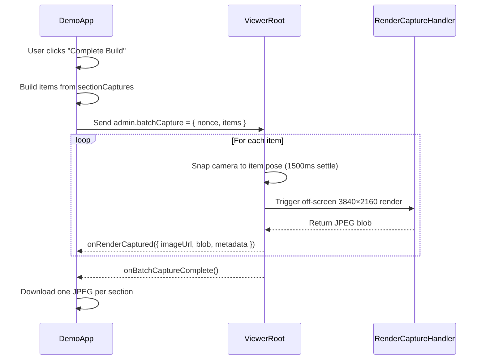

# System Architecture

**Primary reader:** Engineer working on Viewer internals
**Job-to-be-done:** Understand layer boundaries and runtime composition
**Next doc:** [Capture & Replay deep-dive](capture_and_replay.md)

---

## Purpose

The current stable architecture of this repository — public Viewer boundary, internal Viewer runtime layers, and the DemoApp authoring/persistence model. This is the architectural map; for the contract surface see [Viewer Contract v1.7](viewer_contract_v1_7.md), and for the capture lifecycle see [Capture & Replay](capture_and_replay.md).

---

## Top-Level Shape



---

## Current Layers

### DemoApp

Current file:
- [DemoApp.jsx](../src/DemoApp/DemoApp.jsx)

`DemoApp` is the reference host application. It demonstrates the full capture/replay pattern in a minimal host.

It owns:

- demo model selection (manifest models + file upload)
- section and option state
- capture/replay orchestration
- admin mode toggle
- per-model persistence in `localStorage` keyed by model ID (`demoapp_v2_${modelId}`)

It integrates the Viewer through the public contract only:

```jsx
<BuildAndPriceViewer input={viewerInput} output={viewerOutput} />
```

All capture payloads are received via `viewerOutput` callbacks. All replay intent flows back in via `viewerInput`. DemoApp does not reach inside the Viewer.

For the DemoApp header UI, batch-capture button behavior, and developer-oriented aids (Loading/Ready indicator, capture status pills, error banner, payload inspector tooltips), see [DemoApp](demoapp.md).

### BuildAndPriceViewer

Current file:
- [BuildAndPriceViewer.jsx](../src/public/BuildAndPriceViewer.jsx)
- [viewerContractTypes.js](../src/public/viewerContractTypes.js)

This is the stable public integration surface.

It is responsible for:

- accepting `input`
- forwarding `output`
- shielding the host from internal viewer refactors
- staying intentionally narrow

### BuildAndPriceViewerRuntime

Current file:
- [BuildAndPriceViewerRuntime.jsx](../src/viewer/BuildAndPriceViewerRuntime.jsx)
- [hooks/index.js](../src/viewer/hooks/index.js)
- [components/index.js](../src/viewer/components/index.js)
- [useViewerPresentationState.js](../src/viewer/hooks/useViewerPresentationState.js)
- [useViewerSelectionRuntime.js](../src/viewer/hooks/useViewerSelectionRuntime.js)
- [useViewerAuthoringCapture.js](../src/viewer/hooks/useViewerAuthoringCapture.js)

This is the shared internal wrapper runtime. It currently owns:

- presentation editing state (`useViewerPresentationState`)
- mesh selection and material editing state (`useViewerSelectionRuntime`, `useSelectionMaterialState`)
- authoring capture coordination (`useViewerAuthoringCapture`) — fires `ViewerOutput` capture callbacks when admin clicks a capture action
- visibility state (`useVisibilityState`)
- `ViewerAdminNavigationBridge` composition
- when `input.admin.enabled = true`: renders the built-in `ViewerAuthoringDemoPanel` (the authoring overlay on the left) as a viewer-side overlay. The panel is dynamic by default — its content is filtered by `input.admin.activeAuthoringFocus` (`'section' | 'option' | 'view' | 'presentationMode' | 'all'`); a debug-panel toggle can force legacy two-tab mode for testing/revert
- always renders `NavigationDemoPanel` (View row + Summer/Winter mode rows along the bottom) — identical in admin and user modes; it is for navigation only and contains no capture controls
- `ViewerRoot` handoff

### ViewerAdminNavigationBridge

Current file:
- [ViewerAdminNavigationBridge.jsx](../src/viewer/components/ViewerAdminNavigationBridge.jsx)
- [useViewerAdminNavigationBridgeRuntime.js](../src/viewer/hooks/useViewerAdminNavigationBridgeRuntime.js)

This is a viewer-internal helper layer that:

- composes the navigation bridge runtime hook
- supports viewer-internal navigation helpers

This is intentionally kept out of the public wrapper contract.

### ViewerRoot

Current file:
- [ViewerRoot.jsx](../src/viewer/ViewerRoot.jsx)
- [ViewerSceneCanvas.jsx](../src/viewer/components/ViewerSceneCanvas.jsx)
- [ViewerPerformanceOverlay.jsx](../src/viewer/components/ViewerPerformanceOverlay.jsx)
- [ViewerDebugCanvasHelpers.jsx](../src/viewer/components/ViewerDebugCanvasHelpers.jsx)
- [useViewerCameraRuntime.js](../src/viewer/hooks/useViewerCameraRuntime.js)
- [useViewerSceneInteraction.js](../src/viewer/hooks/useViewerSceneInteraction.js)

`ViewerRoot` is the internal runtime boundary.

`ViewerDebugCanvasHelpers.jsx` powers navigation debug visuals and contains a parked custom axis-helper implementation that is intentionally left disabled for now.

It owns:

- model rendering
- composition of camera/runtime orchestration
- quick views and startup reveal behavior
- presentation playback
- scene assignment execution
- composition of scene interaction handoff
- lazy composition of the heavy canvas/renderer scene path
- composition of viewer-local debug/admin helper components

`ViewerRoot` consumes contract-shaped input but remains an internal implementation detail.

#### Batch Capture Runtime

`ViewerRoot` watches `adminInput.batchCapture.nonce` and delegates to `useBatchRenderCapture` when the nonce increments. The hook processes the item queue in sequence: it snaps the camera to each item's pose, waits 1500ms for materials and shadows to settle, triggers an off-screen 3840×2160 JPEG render via `RenderCaptureHandler`, fires `onRenderCaptured` with the resulting blob and metadata, then advances to the next item. When all items are done it fires `onBatchCaptureComplete`. Admin overlays and debug helpers are suppressed during the capture sequence so they do not appear in rendered images.

---

## Scene Runtime

### Visibility

Current file:
- [useVisibilityState.js](../src/hooks/useVisibilityState.js)

Current stable visibility model separates:

- manual hidden geometry
- section-driven hidden geometry
- temporary isolation/focus state

Section presentation replay and authoring tools both affect visibility, but they are not the same kind of state.

Visibility assignments are included in section and view capture payloads and replayed by the App via `viewerInput.scene.visibilityAssignments`. The full shape is `{ hiddenGeometryIds, shownGeometryIds, instantHiddenGeometryIds, isolatedGeometryIds }`. The Viewer resolves show/hide priority: `shownGeometryIds` wins over `hiddenGeometryIds`; `instantHiddenGeometryIds` hides without fade.

### Materials

Current files:
- [useSelectionMaterialState.js](../src/hooks/useSelectionMaterialState.js)
- [useSceneAssignments.js](../src/viewer/hooks/useSceneAssignments.js)

`useSceneAssignments` is a thin coordinator that delegates to two sub-hooks:
- `useSceneVisibility` — fade animation and mesh visibility
- `useSceneMaterialAssignments` — texture and scalar material application

Helper functions for those sub-hooks live in `materialUtils.js` and `modelPreparationUtils.js`.

Current stable material state supports:

- direct material editing of selected geometry
- recent/pending material change tracking
- restore-original material behavior
- replay of option-owned material assignments
- replay of model-level default material assignments

The Viewer applies materials in two layers received through `ViewerSceneInput`:

1. `defaultMaterialAssignments` — the model-level baseline; applied first
2. `materialAssignments` — option-driven overrides; applied second, winning for any geometry both layers target

A `restoreOriginalMaterial: true` entry in `materialAssignments` restores to the model default for that geometry if one exists, or to the baked original otherwise.

---

## Current Authoring Model

### Admin mode is self-contained in the Viewer

When `input.admin.enabled = true`, `BuildAndPriceViewerRuntime` renders the built-in `ViewerAuthoringDemoPanel` (left-side authoring overlay) as a viewer-side overlay. No external panel hosting is needed from the App. The `NavigationDemoPanel` (View row + presentation mode rows along the bottom) renders in both admin and user modes and is purely for navigation — capture/clear actions live in the Authoring Panel.

The Authoring Panel is **dynamic by default** — its content is filtered by `input.admin.activeAuthoringFocus`. See [Dynamic Authoring Panel](integration_guide.md#dynamic-authoring-panel) in the integration guide for the focus → controls table and the App-side state-threading pattern.

The Viewer internally manages:
- presentation editing state (exposure, HDR, terrain, lighting, solar, point lights)
- mesh selection and material editing state
- authoring capture coordination

In Admin Mode, all UI panels (Views, Summer presets, Winter presets, Spaces, Solar, North Arrow) are always visible regardless of their User Visibility flag values. Panels hidden from users show a dashed orange outline so the admin can distinguish them without losing readability.

Capture results are communicated back to the App via `ViewerOutput` callbacks. Five capture families exist:

- **Section captures** — pose + cameraMode + presentationMode reference + visibility + UI flags, per section
- **View captures** — same shape as section captures, keyed by camera mode (Exterior / Interior / Overhead)
- **Presentation mode captures** — full `ViewerPresentationInput` snapshot, per named mode (`'day'`, `'nightExt'`, `'nightInt'`, `'winterDay'`, `'winterNight'`, `'winterNightInt'`)
- **Option captures** — geometry membership + material assignments, per option
- **Model default materials** — model-level baseline material assignments

Section and view captures store a `presentationMode` *name* rather than inline presentation values. The App resolves the full snapshot via `presentationModeCaptures[capture.presentationMode]` at replay time; `capture.ui` flags take precedence over the mode snapshot's flags. The App also pushes its full presentation-mode capture map via `viewerInput.presentationModeCaptures` (added in Contract v1.7) so the Viewer can resolve in-Viewer mode-tile clicks without round-tripping through the App. View captures also drive `SpaceTileClickNav`: clicking a space tile from overhead view applies the Interior view capture automatically.

For payload shapes, replay paths, last-one-wins semantics, and Admin vs User Mode rendering paths, see [Capture & Replay](capture_and_replay.md).

### Ownership rules (App-enforced)

Two **independent** cross-section ownership rules apply at the App's `onOptionCaptured` handler — show/hide ownership and material assignment ownership, each exclusive across sections. Enforcement lives at the App layer because section identity is App-owned (the Viewer fires `onOptionCaptured` with no section context). DemoApp implements the enforcement; any production App integrating the Viewer is expected to apply equivalent rules.

See [Cross-Section Ownership Enforcement](integration_guide.md#cross-section-ownership-enforcement) in the integration guide for the canonical rules, the conflict-detection code, and the rejection-banner pattern.

---

## Persistence Model

Current stable DemoApp behavior:

- authored state is persisted per model, keyed by model ID (`demoapp_v2_${modelId}`)
- storage mechanism is browser `localStorage`
- manifest models use a stable model ID; uploaded ad hoc files are not persisted

Persisted snapshot contents include:
- section captures (`pose`, `cameraMode`, `presentationMode` reference, `visibilityAssignments`, `ui` flags)
- chosen options by section
- option captures (`geometryIds`, `materialAssignments`)
- model default material capture
- view captures (keyed by camera mode; same shape as section captures) — replayed by the App via `viewerInput` when `onViewSelected` fires
- presentation mode captures (keyed by mode; full `ViewerPresentationInput` snapshot; six modes: day / nightExt / nightInt / winterDay / winterNight / winterNightInt)

---

## Camera / Presentation Runtime

The camera runtime composes a handful of distinct behaviors: startup reveal, quick views (exterior/interior/overhead), App-owned pose playback, section and view-capture replay, viewer-resolved routed interior navigation, interior constraint handling during free browsing, and overhead space-tile click (`SpaceTileClickNav`) that navigates to a clicked space via pathNav while applying the Interior view capture's presentation and visibility on arrival.

The presentation runtime owns the visual state — HDR environment, terrain preset, exposure, lighting, solar, point/spot lights — plus User Visibility flags for the panel set (Solar / Site, North Arrow, Views row, Summer/Winter rows, Space Menu). Field-level details live in [`ViewerPresentationInput`](viewer_contract_v1_7.md#presentation).

Solar date/time is included in section and view capture snapshots as part of the `presentation.solar.time` field. When a capture is replayed, the sun angle is restored to exactly what it was at capture time. There is no standalone App-level solar time control — interactive solar adjustment lives in the Viewer's SolarPanel. The App acts as a transparent conduit: it stores `solar.time` as part of the capture payload and passes it back through `viewerInput.presentation.solar.time` during replay.

### Solar Time — Two Tracks

Solar time has two separate tracks:

1. **Authoritative solar time** — stored in `snapshot.solar.time` as part of the captured presentation snapshot. Sourced from App input (replayed via `input.presentation.solar.time`) or a hardcoded default when no capture exists. This is the time used for all captures and is the ground truth for deterministic replay.

2. **Preview solar time** (`previewSolar` state) — set by the Solar playback panel for real-time preview during authoring. This is a viewer-local override for interactive viewing only. It is **never** written into the snapshot or fired back to the App. It is cleared automatically when any section or view change occurs (via `applyPresentation`) and when `applyPresentation` is called due to the App's `presentation` input reference changing with different values.

---

## Geometry Identity

Current implementation assigns stable `geometryId` values during model preparation.

That stable identity is important for:

- visibility replay
- material replay
- option geometry ownership
- persistence across reloads

Viewer runtime still tolerates UUID fallback in some places for compatibility, but stable `geometryId` is the architectural direction.

---

## Runtime Flows

### Product Playback Flow



### Section Activation Flow



### Authoring Capture Flow



### Batch Capture Flow



---

## Architectural Rules Worth Keeping

### 1. Keep the public wrapper narrow

`BuildAndPriceViewer` should stay centered on:

- `input`
- `output`

and should continue to hide:

- `ViewerRoot`
- viewer-local debug tools
- authoring UI internals

### 2. Keep App intent separate from Viewer execution

The App should continue to own:

- what configuration is chosen
- what presentation should be replayed
- what should persist

The Viewer should continue to own:

- how that intent is executed at runtime
- all admin panel UI when `admin.enabled = true`

### 3. DemoApp is scaffolding, not the final SaaS product

`DemoApp` demonstrates the capture/replay contract and is the reference integration example.

It is not yet the final production SaaS admin application. Persistence, pricing, product catalogues, and multi-user workflows are App-layer concerns that DemoApp intentionally leaves minimal.

---

## Summary

The architecture is in a clean single-owner state:

- the Viewer owns its own admin UI (no external bridge hosting required)
- the App owns stored captures and replay intent
- all communication goes through `input`/`output` — no internal bridges, no dual-state sync
- DemoApp is the canonical reference for how a real App integrates the Viewer

Adding a new capture type means: add a `ViewerOutput` callback, capture it in the Viewer, store it in the App, replay it through `viewerInput`. The pattern is consistent across all capture types.

---

## Glossary

See [Overview](overview.md#glossary) for the canonical glossary.
